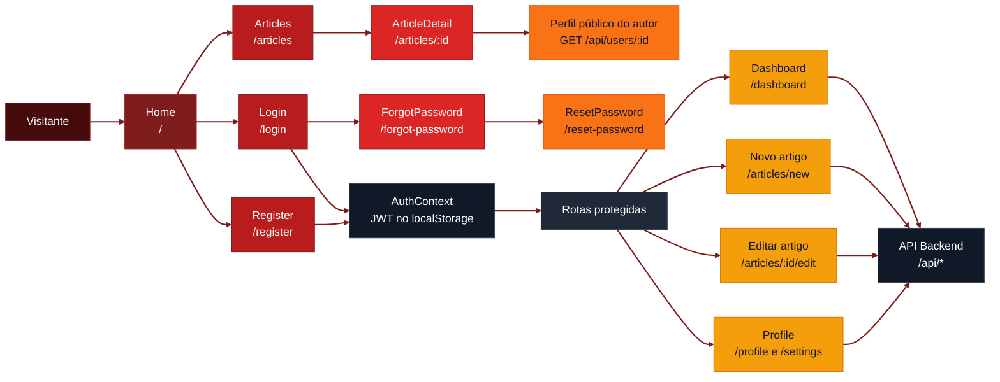
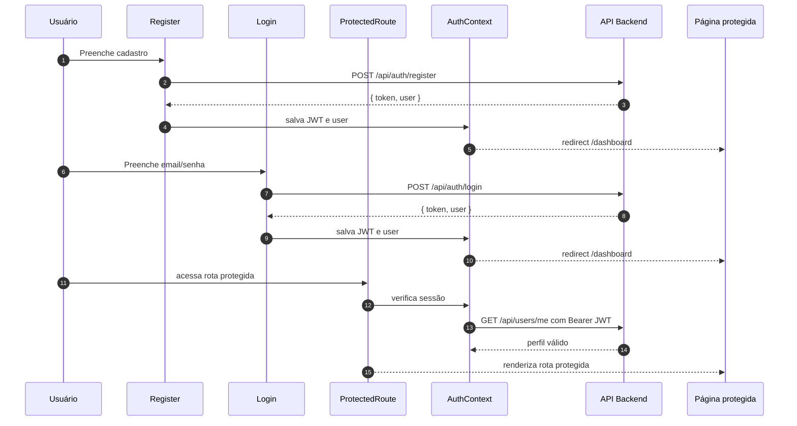

# Blog Mind Group - Frontend

<p align="center">
  
  
  
  
</p>

<p align="center">
  
  
  
  
  
  
</p>

<p align="left">
  <strong>Interface React para um blog full stack com autenticação JWT, editor de artigos, dashboard, avatar e recuperação de senha.</strong><br />
  Frontend do desafio Mind Group, construído com React, TypeScript, Vite, React Router e Axios para consumir a API Express/MySQL do projeto.
</p>


---

## Visão geral

**Blog Mind Group - Frontend** é a aplicação web do desafio de blog. Inclui listagem pública de artigos, visualização de detalhes, cadastro, login, recuperação de senha, dashboard do autor, editor protegido de artigos, perfil do usuário com avatar e integração com categorias/tags do backend.

O frontend separa navegação pública de operações autenticadas:

1. Visitantes listam, filtram e visualizam artigos.
2. Usuários cadastrados acessam dashboard, criam artigos e editam/removem apenas o que o backend autoriza.
3. O perfil permite atualizar nome, email, bio e avatar em base64.
4. O editor de artigos valida capa localmente antes de enviar ao backend.
5. O Axios injeta `Authorization: Bearer <token>` a partir do JWT salvo pelo `AuthContext`.

O foco da entrega é facilitar a avaliação local: clonar, instalar, configurar `.env`, rodar junto com o backend e validar os fluxos principais do blog.

---

## Demo

<p align="center">
  
</p>

---

## Funcionalidades

- Listagem pública de artigos com busca e filtro por categoria.
- Visualização de artigo com avatar do autor.
- Cadastro e login com JWT.
- Dashboard do autor com métricas reais vindas de `GET /api/dashboard`.
- Criar, editar e excluir artigos com upload de capa.
- Perfil com upload de avatar.
- Recuperação de senha com token de redefinição.
- Proteção de rotas autenticadas com `ProtectedRoute`.
- Cliente HTTP centralizado em `src/services/api.ts`.

---

## Fluxo



---

## Fluxo de autenticação



---

## Stack

- **React 18** para interface componentizada.
- **TypeScript** para tipagem e build seguro.
- **Vite** para desenvolvimento e build de produção.
- **React Router v6** para rotas públicas e protegidas.
- **Axios** para cliente HTTP com base URL configurável.
- **Context API** para estado de autenticação.
- **CSS próprio** em `src/styles.css`.
- **Lucide React** para ícones.

---

## Requisitos

- Node.js 20+
- npm
- Backend rodando em `http://localhost:3333`
- Dump do banco importado no backend

---

## Setup

```powershell
cd "D:\Dev\Projects\Mind Group\blog-frontend"
npm install
Copy-Item .env.example .env
npm run dev
```

Aplicação local:

```text
http://localhost:5173
```

Antes de testar os fluxos autenticados, rode o backend e confirme que a API está acessível em:

```text
http://localhost:3333/api
```

---

## Acesso para teste

O frontend pode ser testado com qualquer usuário criado pela tela de cadastro.

Se o backend estiver com o `dump.sql` importado, também é possível usar a credencial seed local:

```text
Email: admin@mindgroup.com
Senha: Admin@123
```

Essa credencial é apenas seed local de avaliação. Não use em produção.

---

## Variáveis

```env
VITE_API_URL=http://localhost:3333/api
```

| Variável | Descrição | Exemplo |
|---|---|---|
| `VITE_API_URL` | URL base da API backend consumida pelo Axios | `http://localhost:3333/api` |

---

## Rotas

### Públicas

| Rota | Página | Descrição |
|---|---|---|
| `/` | `Home` | Página inicial com destaques e chamada para artigos |
| `/articles` | `Articles` | Lista pública com busca e filtro por categoria |
| `/articles/:id` | `ArticleDetail` | Detalhe público do artigo |
| `/login` | `Login` | Login do usuário |
| `/register` | `Register` | Cadastro do usuário |
| `/forgot-password` | `ForgotPassword` | Solicita token de redefinição |
| `/reset-password` | `ResetPassword` | Redefine senha com token |

### Protegidas

| Rota | Página | Descrição |
|---|---|---|
| `/dashboard` | `Dashboard` | Métricas e artigos recentes do autor logado |
| `/articles/new` | `ArticleEditorPage` | Criação de artigo |
| `/articles/:id/edit` | `ArticleEditorPage` | Edição de artigo |
| `/profile` | `Profile` | Perfil do usuário logado |
| `/settings` | `Profile` | Alias visual para configurações de perfil |

### Integração pública de autor

| Endpoint consumido | Uso no frontend |
|---|---|
| `GET /api/users/:id` | Busca avatar e bio públicos do autor no detalhe do artigo |

---

## Integração com API

O cliente Axios fica em `src/services/api.ts`.

Principais grupos consumidos:

- `authApi`: cadastro, login, sessão, esqueci senha e reset de senha.
- `userApi`: atualização do perfil e perfil público do autor.
- `dashboardApi`: métricas reais do autor autenticado.
- `articleApi`: listagem, detalhe, criação, edição e remoção de artigos.
- `taxonomyApi`: categorias e tags.

---

## Fluxo Para Avaliação

1. Importe o dump do backend.
2. Rode o backend em `http://localhost:3333`.
3. Rode o frontend em `http://localhost:5173`.
4. Crie uma conta pela tela de cadastro.
5. Teste:

- listar artigos;
- abrir artigo;
- criar artigo com capa;
- editar artigo;
- excluir artigo;
- atualizar perfil com avatar;
- recuperar senha;
- acessar dashboard autenticado.

---

## Scripts

```powershell
npm run dev
npm run build
npm run preview
```

| Script | Descrição |
|---|---|
| `npm run dev` | Sobe a aplicação com Vite |
| `npm run build` | Compila TypeScript e gera build de produção |
| `npm run preview` | Serve localmente o build gerado |

---

## Estrutura do projeto

```text
blog-frontend/
├── src/
│   ├── App.tsx                  # Registro de rotas
│   ├── main.tsx                 # Bootstrap React
│   ├── styles.css               # CSS global próprio
│   ├── types.ts                 # Tipos compartilhados
│   ├── utils.ts                 # Helpers de data, imagem e erro
│   ├── components/
│   │   ├── ArticleCard.tsx
│   │   ├── ArticleForm.tsx
│   │   ├── ConfirmDialog.tsx
│   │   ├── Layout.tsx
│   │   └── ProtectedRoute.tsx
│   ├── context/
│   │   └── AuthContext.tsx      # Sessão, JWT e perfil logado
│   ├── pages/
│   │   ├── ArticleDetail.tsx
│   │   ├── ArticleEditorPage.tsx
│   │   ├── Articles.tsx
│   │   ├── Dashboard.tsx
│   │   ├── ForgotPassword.tsx
│   │   ├── Home.tsx
│   │   ├── Login.tsx
│   │   ├── Profile.tsx
│   │   ├── Register.tsx
│   │   └── ResetPassword.tsx
│   └── services/
│       └── api.ts               # Axios e grupos de API
├── banner.png
├── photo.png
├── LICENSE.txt
├── .env.example
├── package.json
└── README.md
```

---

## Contribuindo

Contribuições são bem-vindas.

1. Faça um fork do repositório.
2. Crie uma branch: `git checkout -b feature/sua-feature`.
3. Commit suas alterações: `git commit -m "feat: minha contribuição"`.
4. Push da branch: `git push origin feature/sua-feature`.
5. Abra um Pull Request com um resumo das alterações.

Use [Conventional Commits](https://www.conventionalcommits.org/): `feat:`, `fix:`, `docs:`, `style:`, `refactor:`, `test:`, `chore:`.

---

## Licença

Este projeto está licenciado sob a licença **MIT**. Veja [LICENSE.txt](./LICENSE.txt).

---

<p align="center">
  Desenvolvido com ☕ por <a href="https://github.com/devAndreotti">devAndreotti</a>
</p>
